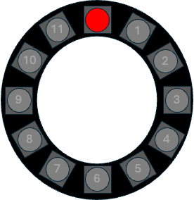
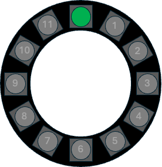
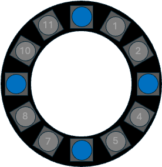
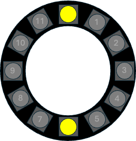

# GWIDC USER GUIDE PART 2: PIXEL INDICATIONS DURING BOOT UP 

|Pixel Display|Description|
|:----------------------------------:|:----------------------------------------|
|Red pixel @ position 0 |GWIDC is in WiFi Configuration Mode. It has opened the GWIDC_AP access portal and is waiting on user to supply network credentials through the portal.|
|Green pixel (flashing) @ position 0 |GWIDC is in WiFi Configuration Mode. It has successfully connected to the network, and is about to reboot. |
|Yellow pixel @ position 0 |Part of normal boot up sequence. The GWIDC is initializing and attempting to connect to the network.   Connection may take a few seconds, but if the device appears to “hang” at this stage, there may be a problem with the network credentials. (This can happen if the GWIDC was rebooted from a “hung” Configuration State--see above. In this case unplug the GWIDC for a few seconds and then power it back up. If it fails to connect, manually RESET the GWIDC and go back to the access portal to enter credentials).    NOTE: The NodeMCU WiFI radio can have issues if the GWIDC is physically too close to the router.|
|Blue pixel @ position 0 |Part of normal boot up sequence.  The GWIDC is connected to the network and ready to accept commands.   If the Hubitat IP address and port have been configured, then this state will be very brief.   If the Hubitat IP address and port are <ins>not</ins> configured (null or invalid values) the GWIDC will idle in this state.|
|Blue pixels @ positions 0, 3, 7, and 11 |Part of normal boot up sequence. The GWIDC is connected to the network, has sent an initial STARTUP message to the Hubitat IP address/port, and is ready to accept commands from the Hubitat.  If the device stays in this state for an extended period: - Verify that the device was supplied with the correct static IP and port number of the target Hubitat hub (check via web browser with `http://<GWIDC_IPAddress>/REPORT_SETTINGS`  - Verify that the Hubitat is online at the correct static IP address, and verify that the GWIDC has been added to Hubitat with the correct  configuration (Device Network ID, Device Type, and device IP address).  If everything checks out, rebooting the device should fix the problem. Otherwise, the problem may be with the router or network itself|
|Yellow pixels @ positions 0 and 6 |GWIDC has disconnected from the network. It will attempt to reconnect with previously saved credentials.  This can take less than a second or up to a few seconds.|
|Any other pixel colors/patterns|The GWIDC pixels and the piezo buzzer change in response to properly formatted messages from the Hubitat and from browser HTTP calls|

---

&copy; 2025 Tim Sakulich. GWIDC documentation is licensed under Creative Commons Attribution-ShareAlike 4.0 International.  
See: [`LICENSE-DOCS`](/LICENSE-DOCS)
