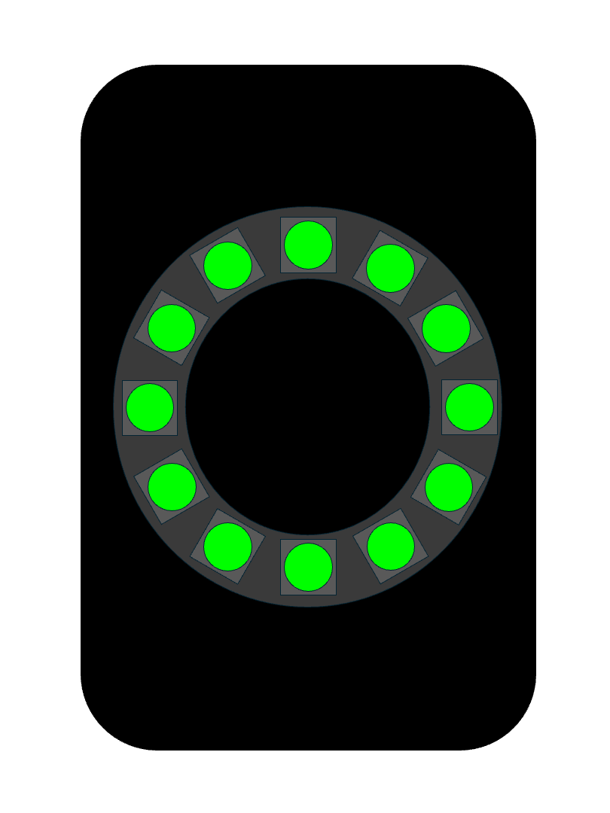
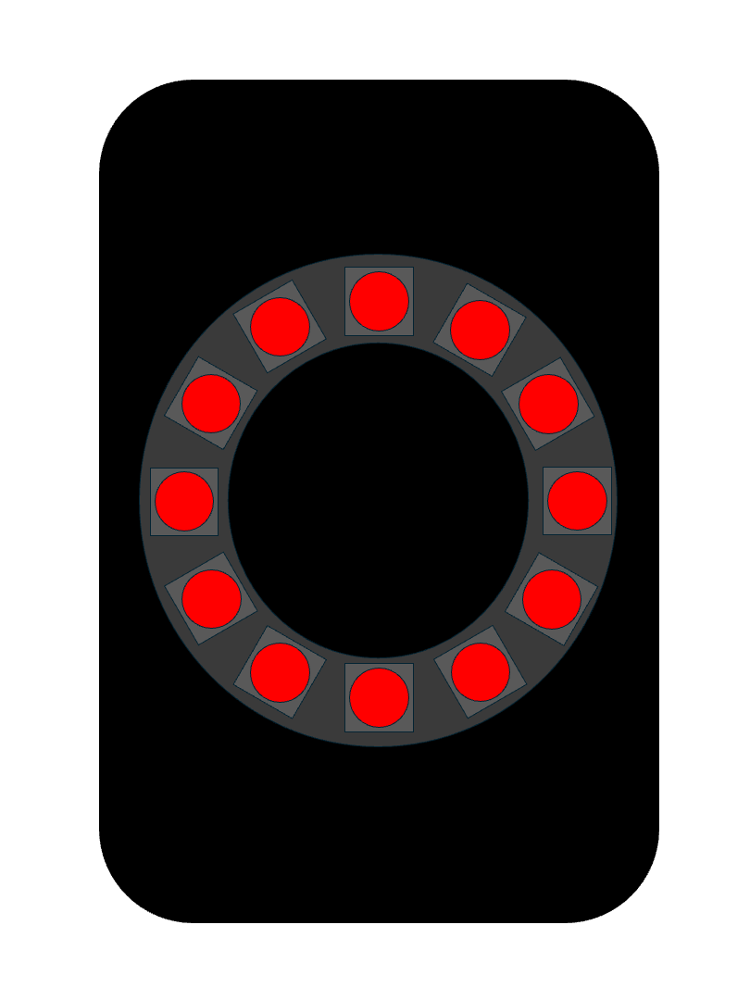
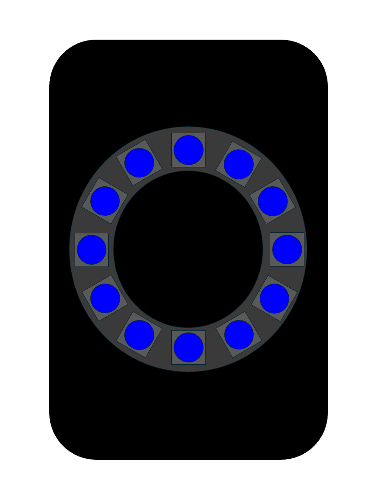
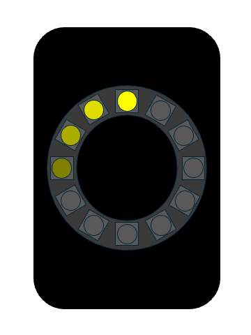

## GWIDC EXAMPLE DISPLAY MODE ANIMATIONS

### Example of FLASH mode in Green
`http://<GWIDC_IPAddress>/?FLASH&RGB=00FF00` 

### Example of PULSE mode in Red
`http://<GWIDC_IPAddress>/?PULSE&RGB=FF0000` 

### Example of SOS mode in Red
`http://<GWIDC_IPAddress>/?SOS&RGB=FF0000` 

### Example of STROBE mode in Blue
`http://<GWIDC_IPAddress>/?STROBE&RGB=0000FF` 

### Example of TRAIL mode in Yellow
`http://<GWIDC_IPAddress>/?TRAIL&RGB=FFFF00` 

---

&copy; 2025 Tim Sakulich. GWIDC documentation is licensed under Creative Commons Attribution-ShareAlike 4.0 International.  
See: [`LICENSE-DOCS`](/LICENSE-DOCS)

