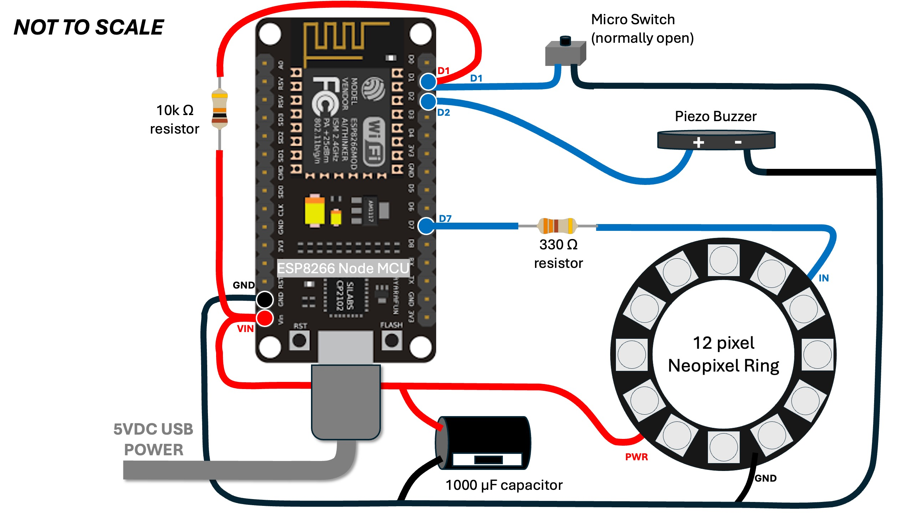
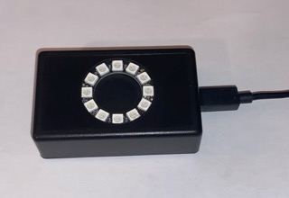
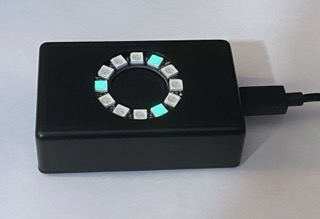
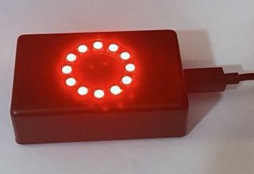

# GWIDC HARDWARE BUILD

## Components and Connections

|Component|Notes|
|:---|:---|
|NodeMCU 1.0 |ESP8266-based Development Board built around ESP-12E module|
|Power Supply|Connect standard USB power via NodeMCU micro USB port /or/  use a standalone 5VDC 2A power supply connected to VIN and GND pins of the NodeMCU |
|Neopixel Ring (12 pixel)  with 330 ohm resistor  and 1000 µF capacitor|Connect Neopixel Ring PWR to VIN on the NodeMCU board Connect Neopixel Ring GND to GND on the NodeMCU board Connect Neopixel Ring IN to D7 (GPIO13) on the NodeMCU board via 330 ohm resistor Connect 1000uF Capacitor across GND and PWR |
|Piezo Buzzer|Connect Piezo's positive lead to D2 (GPIO4) on the NodeMCU board Connect the Peizo's negative lead to GND|
|Micro Button Switch and 10k ohm resistor|This serves as a manual RESET button.  Connect one of the switch leads to the D1 pin on the NodeMCU board Connect the other switch lead to GND on the NodeMCU board Connect D1 pin on the NodeMCU board to VIN via 10k ohm resister|
|Project Box (if desired for aesthetics)|The entire hardware build can fit inside an ABS Plastic Project Box measuring 3.15 x 1.97 x 1.02 inch (80 x 50 x 26 mm).   - Drill a 1-3/8 inch round hole in the face of the box and mount the Neopixel ring from the inside of the box with the pixels facing outward.   - Drill a small rectangular opening at one end of the box so that a USB power cable can be connected to the micro USB port on the NodeMCU board.   - Mount the micro button switch to the inside of the box and drill a small hole in the box so that the button can be pushed by inserting the end of paperclip through the hole.|

## Wiring Diagram

## Firmware

Once the hardware build is complete, upload the latest GWIDC software release via the USB serial port on the NodeMCU board (see [`src/README.md`](src/README.md)). 

Though the initial software upload must be done via NodeMCU serial port, the GWIDC does have an Over-the-Air (OTA) update capability. Once the GWIDC is connected to a WiFi network, new software releases can be uploaded over WiFi using the Arduino IDE.

 

## Photos of GWIDC in a Project Box

    

---

&copy; 2025 Tim Sakulich. GWIDC documentation is licensed under Creative Commons Attribution-ShareAlike 4.0 International.  
See: [`LICENSE-DOCS`](/LICENSE-DOCS)

