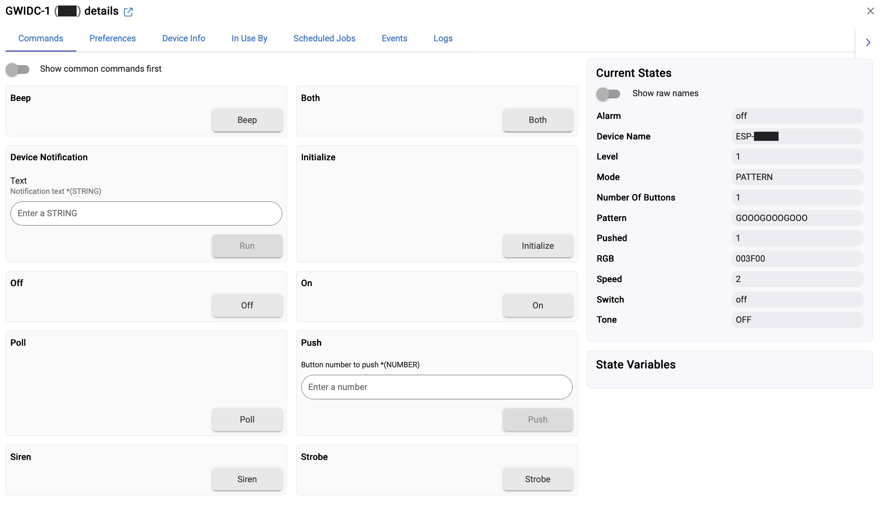
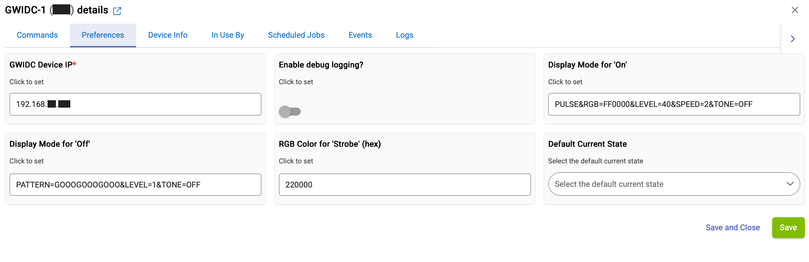
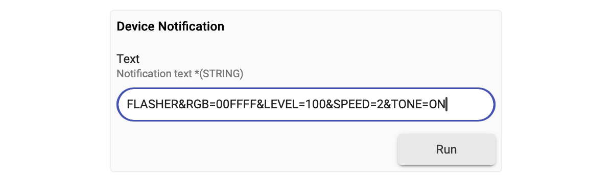

# GWIDC WITH HUBITAT - USERS GUIDE

## DEVICE CAPABILITIES

The GWIDC driver includes the following capabilities available through the GWIDC device Commands tab (see screenshot below) and also available to apps (e.g., rules)

|Command | Description|
|:----|:----|
|Beep| Causes the GWIDC piezo buzzer to beep one time.|
|Device Notification | Allows access to the full range of GWIDC display modes and display mode parameters beyond those that are pre-defined by the device driver.  See [USING THE DEVICE NOTIFICATION CAPABILITY](#USING-THE-DEVICE-NOTIFICATION-CAPABILITY) section below and the GWIDC Users Guide for more details.|
|Initialize | Used to simulate receiving a STARTUP message from the GWIDC, and results in a call to the driver push() method. Mostly for troubleshooting.|
|On, Off| Allows the GWIDC to be treated like a bulb that can be turned on or off by apps and rules.   The display modes and parameters used for these capabilities can be changed on the Preferences page (see illustrations in next section for their default values).|
|Poll| Updates the device Current State values in Hubitat based on the current settings reported by the GWIDC. These values are shown on the device’s Commands tab and available to apps and rules. |
|Push |The driver includes this capability simply as a way to trigger rules within Hubitat.    When the GWIDC device sends a JSON message containing STARTUP as the mode, the driver calls the initialize() method, which then creates a button 1 push() event. That push() event is seen by Rule Machine and other apps, and is useful to synchronize the GWIDC based on the current status of other devices (such as a door being open or closed). It is a workaround to writing separate application code. It performs no actions on the GWIDC device itself.|
|Strobe, Siren, Both| Allows the GWIDC to be treated like an alarm device that can be triggered by apps and rules.   The base RGB color used for the strobing capability can be changed on the Preferences page (see illustrations in next section for their default values).|

 

### SCREENSHOT: GWIDC DEVICE COMMANDS TAB

 

## GWIDC DEFAULTS FOR ON, OFF, & STROBE COMMANDS

|Pixel Display|Description|
|:---:|:----|
|"Off" command | Defaults to green pixels in triangle configuration.   EXPLANATION: In the Preferences tab for the device (see screenshot below), the default value for "Display Mode for 'Off'" is `PATTERN=GOOOGOOOGOOO&LEVEL=1&TONE=OFF`
|"On" command | Defaults to red pixels (slowly pulsating)  EXPLANATION: In the Preferences tab for the device (see screenshot below), the default value for "Display Mode for 'On'" is `PULSE&RGB=FF0000&LEVEL=40&SPEED=2&TONE=OFF`|
|"Strobe" command | Defaults to four flashing white pixels on red background  EXPLANATION: In the Preferences tab for the device (see screenshot below), the default value for "RGB Color for 'Strobe' (hex)" is `220000` (NOTE: the driver automatically uses the RGBSTROBE display mode with max brightness)|
|Any other pixel colors/patterns|The GWIDC pixels and the piezo buzzer change in response to properly notification text strings from Hubitat |

 

### SCREENSHOT: GWIDC DEVICE PREFERENCES TAB

# USING THE DEVICE NOTIFICATION CAPABILITY

The Device Notification capability is a way to directly access the full range of GWIDC functionality from the device Commands tab and from within Hubitat applications and rules. This enables a great deal of flexibility for the user to customize use cases for the device, without requiring edits to the device driver itself. See the document named [`GWIDC-Hubitat-Use-Cases.md`](GWIDC-Hubitat-Use-Cases.md) in this folder for examples.

Refer to Part 3 of the GWIDC Users Guide ([`GWIDC-User-Guide-Pt3-HTTP-Commands.md`](/docs/GWIDC-User-Guide-Pt3-HTTP-Commands.md)) in the `/docs` folder for the full list of display modes and display mode modifiers.

Unlike submitting HTTP messages directly to the GWIDC through a browser window, DO NOT include the IP Address of the device or the question mark symbol as part of the Device Notification text string. The device's IP address is already configured in the Preferences tab during initial setup of the device on Hubitat.

For example, to set the device mode to FLASHER, RGB color to 00FFFF, BRIGHTNESS to 100, SPEED to 2 (medium), and activate the piezo buzzer, the user would submit the following as the Device Notification text string via the device Commands tab or as an action in a rule.  `FLASHER&RGB=00FFFF&LEVEL=100&SPEED=2&TONE=ON` 

And here's a screenshot of entering this text string from the device commands tab:

>[!NOTE]
>The GWIDC driver in Hubitat only supports sending display mode and display mode parameters via the Device Notification capability. The driver does not support sending GWIDC standalone commands such as HUB_CONFIG, REPORT_SETTINGS and VERSION_INFO using the Device Notification capability.

---

&copy; 2025 Tim Sakulich. GWIDC documentation is licensed under Creative Commons Attribution-ShareAlike 4.0 International.  
See: [`LICENSE-DOCS`](/LICENSE-DOCS)
